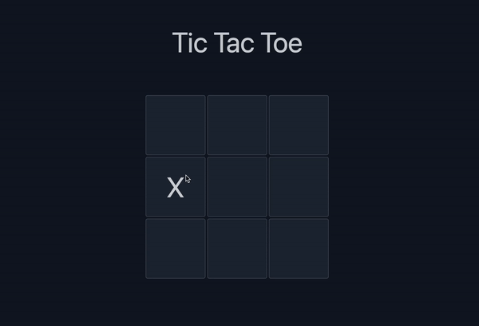

<p align="center">
    
</p>

[](https://app.netlify.com/sites/elmouraa-tic-tac-toe/deploys)
[](https://elmouraa-tic-tac-toe.netlify.app/)

This is a simple Tic Tac Toe app. It has been created using React, Typescript, Vite, Tailwind and deployed through netlify.

## Quick start

Make sure you have pnpm installed:

```
npm i -g pnpm
```

Clone the repository and open the directory:

```
git clone https://github.com/elmouraa/tic-tac-toe.git
cd tic-tac-toe
```

Install the dependencies:

```
pnpm i
```

Run the website locally:

```
pnpm dev
```

You can access the website locally at [localhost:5173](https://localhost:5173)
